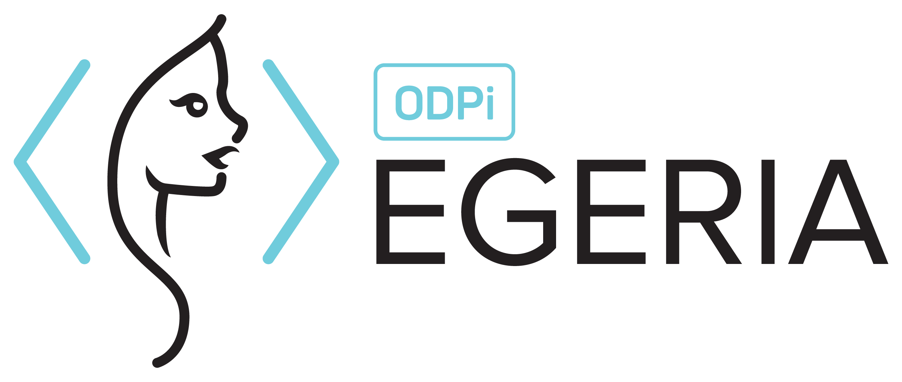

<!-- SPDX-License-Identifier: CC-BY-4.0 -->
<!-- Copyright Contributors to the ODPi Egeria project. -->

   

# Personal Experience - Data Governance

I worked on this project as a POC (Proof of Concept), to use Egeria and test the interaction with Apache Atlas to retrieve the metadata (description of data; table columns, lineage and much more) from the Hadoop cluster (Hortonworks).

The test was proved to be successful, the interaction between both tools worked without any complications. Both solutions have worked together and have very similar functionalities, however Egeria provides a wide variety of functionalities for Data Governance and has a very interesting/ambitious roadmap.

Both tools use Kafka to communicate with each other. Egeria takes advantage of Kafka and proposes a very interesting concept to use it for Data Governance.

Stack: Egeria (Open Source), RedHat server 7, JVM, Kafka, Apache Atlas, REST API, Hadoop, Hortonworks

# Egeria - Open Metadata and Governance

Egeria provides the Apache 2.0 licensed open metadata and governance type system, frameworks, APIs, event payloads and interchange protocols to enable tools, engines and platforms to exchange metadata in order to get the best value from data whilst ensuring it is properly governed.

# Hadoop Ecosystem Repository Connectors

This repository houses the ODPi Egeria connectors for various Hadoop ecosystem components:

- [Apache Atlas](https://atlas.apache.org) is an open source metadata repository. This connector provides an example
    implementation for interacting with a metadata repository through the open metadata standards of Egeria.

    Note that currently the implemented connector is read-only: it only implements those methods necessary to search, retrieve,
    and communicate metadata from Atlas out into the cohort -- it does *not* currently implement the ability to update Atlas
    based on events received from other members of the cohort. (This is due to some current limitations in Apache Atlas --
    see [open issues](https://github.com/odpi/egeria-connector-apache-atlas/issues?q=is%3Aissue+is%3Aopen+label%3Aexternal).)

    Furthermore, [only a subset of the overall Open Metadata Types are currently implemented](docs/mappings/README.md).

- [Apache Ranger](https://ranger.apache.org) is a framework to enable, monitor and manage comprehensive data security
    across the Hadoop platform.  (Coming soon.)

## How it works

The Apache Atlas Repository Connector works through a combination of the following:

- Apache Atlas's REST API, itself abstracted through the Apache Atlas Java Client
- Apache Atlas's embedded Apache Kafka event bus
    - specifically the `ATLAS_ENTITIES` topic

----
License: [CC BY 4.0](https://creativecommons.org/licenses/by/4.0/),
Copyright Contributors to the ODPi Egeria project.
